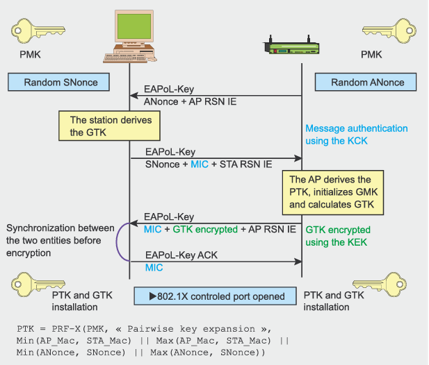

# Aircrack Lab

Estimated Completion Time: 20 minutes

In this lab you will:
- Learn about the aircrack suite of tools
- Learn about 802.11 protocol basics and hardware that can interact with the protocl
- Leverage the aircrack suite to crack WPA/WPA2

## What is Aircrack?

Aircrack next generation (aircrack-ng) is a complete suite of tools to assess WiFi network security. All tools are command line which allows for heavy scripting. Aircrack's main website ([ref 1](#references)) contains a plethora of resources to follow and learn more about the depth of tools and capabilities it offers, but this lab will focus on just one of the many tutorials ([ref 2](#references)) from Aircrack - the tutorial about cracking WPA/WPA2. 

 </img>

Above you will see a standard WiFi network layout, formally known as an extended service set (ESS). Within the ESS, there is a distribution system that connects multiple access points (AP), and each access point provides connectivity to several stations (STA). The stations connect to the access point via the Service Set Identifier (SSID) and the APs communicate with the wired network using the ethernet protocol IEEE 802.3. The Extended SSID (ESSID) is what you are familiar with - it is the human readable AP name. The Basic SSID (BSSID) is what the STA sees. Each AP has a unique BSSID, but ESSIDs can be shared and also exist for human-readability.

 </img>

WiFi Protected Access (WPA) is the standard for WiFi security that supercedes the insecure Wired Equivalent Privacy (WEP). WPA features include authentication, encryption, and data integrity. While we will be walking through a tutorial for WPA/WPA2 cracking today, it is important to note that WPA3 is the latest available WiFi security mechanism as of 2018 ([ref 3](#references)). The diagram above shows the general process through which we will gain the pre-shared key (PSK) by capturing the 4-way handshake at the bottom of the image and conducting a dictionary attack with a known list of passwords to obtain a match. Specifically, after capturing the first two messages, we know the ANonce and SNonce and can start guessing at the PSK value to calculate the PTK and derived temporary keys.This is an intensive brute-force process, so it will be time intensive on APs with sophisticated passwords. Other key acronyms in the diagram:
- **ANonce**: AP Nonce - a random value generated by the AP
- **EAPoL**: Exensible Authentication Protocol over LAN - IEEE 802.1X protocol that uses various packets for authentication mechanisms, in our case, we're looking at the EAPoL-Key packets.
- **GMK**: Group Master Key
- **GNonce**: Group Nonce - 
- **GTK**: Group Transient Key - derived from GMK, AP MAC, GNonce, and Group Key Expansion
- **MIC**: Message Integrity Code - 
- **PMK**: Pairwise Master Key - if PSK is used, PMK = PSK. Otherwise, if an authentication server is used, PMK is derived from IEEE 802.1X authentication master key.
- **PTK**: Pairwise Transient Key - key derived from the PMK to be transmitted over the air in plain text
- **RSN IE**: Robust Security Network Information Element - 
- **SNonce**: STA Nonce - a random value generated by the STA

PSK =  PBKDF2(password, SSID, SSID length, 4096, 256) where PB KDF2 is a method used in PKCS#5, 4096 is the number of hashes and 256 is the length of the output.

## Hardware

Alfa AWUS036ACM ([ref 5](#references)) is a WiFi card that can be placed into monitor mode. Generally, I prefer the MediaTek chips which is typically denoted in Alfa's naming convention with the "M" suffix in their name. If Alfa omits the "M", the WiFi chip is typically a RealTek. In either case, it is best practice to check compatibility with tools like the one listed at [ref 6](#references) that crawl the Linux Kernel Driver Database ([ref 7](#references)) for compatibility. As the below photos show, the MediaTek driver is supported by default in the Linux kernel while one of the RealTek chips are not supported! Installing drivers can be fun I guess, depending on your perspective?

GL.iNet GL-AR300M16 Mini Travel Wireless Pocket Router [ref 6](#references) is the WiFi router that we will target with the Alfa AWUS036ACM. While it is out of the scope of this project, I prefer the GL.iNet routers because they are loaded with OpenWRT ([ref 9](#references)) out of the box. This can open the door to some fun experimentation later rather than routers that have closed source firmware.

## Usage

1. `sudo airmon-ng` shows you the wireless interfaces that you have available, as well as their chipset. Not all chipsets are able to enter monitor mode, so ensure that your chipset is compliant. The chipset associated with the Alfa AC1200 is the MediaTek Inc MT7612U 
2. `sudo airmon-ng start <interface name>` starts the interface in monitor mode
3. `iwconfig` list all wireless interfaces and confirm that the interface was just placed in monitor mode by seeing "Mode:Monitor" next to the interface name
4. `sudo airodump-ng <interface name>` will start monitoring everything on a specific WiFi channel. You'll see a screen appear with BSSIDs, ESSIDs, and STA MACs, as well as some other relevant data. 
5. Find the BSSID for the GL.iNet router. It should be fairly easy to identify based off of the ESSID. Copy the BSSID and have it handy for the next steps.
6. Hone in on the BSSID for the GL.iNet router to determine if there are clients connected to its network. `sudo airodump-ng --bssid <BSSID> -w <file name> <interface name>`. You may have to wait awhile for clients to show up. Two clients should appear. Save the STA MAC for use in the next step. Take note of the channel that the AP is operating on and hone in further with `sudo airodump-ng -c <channel number> --bssid <BSSID> -w <file name> <interface name>`. Otherwise, airodump will scan through channels.
7. In a separate terminal, `sudo aireplay-ng -0 1 -a <BSSID> -c <STA MAC> <interface name>` to deauthenticate the specific client from the network and force them to reconnect. Alternatively, you can wait for a new client to show up OR ask one of the lab administrators to connect a new client for you.
    - You will know you are successful if in your `airodump-ng` terminal you see "WPA handshake" in the top right corner of the screen followed 
8. Quit your airodump and proceed with the following command to try and recover the PSK: `sudo aircrack-ng -w password.lst -b <BSSID> <filename>*.cap` where BSSID is the BSSID that appears next to the "WPA Handshake" in airodump, which should match the BSSID of your target AP.
    - if successful, you should see the PSK. You can now authenticate to the network on your own!
9. Congratulations, you have finished the lab. Please do not share the PSK with anyone so as to not spoil the surprise. Remove all of your file captures from the local machine with `rm <filename>*`.

## References
1. Aircrack-ng main website: https://aircrack-ng.org/doku.php?id=Main
2. Tutorials on aircrack's website: https://aircrack-ng.org/doku.php?id=tutorial
3. WiFi Alliance on WPA3 security: https://www.wi-fi.org/discover-wi-fi/security
4. WPA2 Packet Capture Walkthrough: https://www.aircrack-ng.org/doku.php?id=wpa_capture
5. Alfa AWUS036ACM (https://www.alfa.com.tw/products/awus036acm?variant=39477234597960)
6. Hardware for Linux Checker: https://linux-hardware.org/?view=search
7. Linux Kernel Driver Database: https://cateee.net/lkddb/
8. GL.iNet AR300M (https://www.gl-inet.com/products/gl-ar300m/)
9. OpenWRT (https://openwrt.org/)